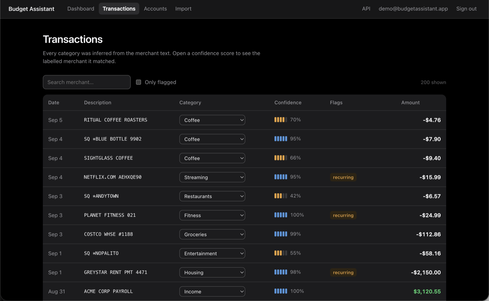
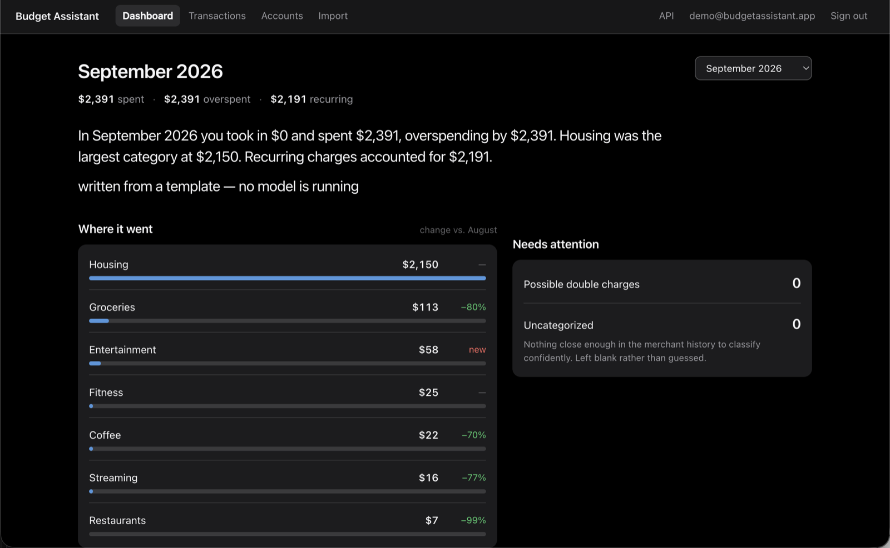

# Budget Assistant

[](https://github.com/sam-michaels/Budgeting-Assistant/actions/workflows/ci.yml)

A personal-finance web app that categorizes bank transactions by meaning rather than by
string matching, and flags the double charges and quiet subscriptions that keyword rules
miss.



**Stack:** ASP.NET Core 10 · Blazor Server · EF Core (Code-First) · PostgreSQL + pgvector ·
ONNX Runtime · Ollama · xUnit

---

## What it actually does

Bank statements are hostile text. The same coffee shop appears as `BLUE BOTTLE COFFEE`,
`SQ *BLUE BOTTLE 4471`, and `SQ *BLUE BOTTLE 9902`; a subscription rotates its reference
code every month so no two charges share a string. Keyword rules need a new rule per
merchant and still miss the variants.

This app embeds each merchant description into a 384-dimension vector and works in that
space instead:

| Feature | How |
|---|---|
| **Auto-categorization** | k-NN against a labelled corpus plus your own past corrections, with a similarity-weighted vote |
| **Duplicate detection** | Same merchant, same amount to the cent, within three days |
| **Subscription detection** | Merchant clusters on a monthly cadence — catches rotating reference codes that exact grouping cannot |
| **Monthly insight** | A three-sentence summary, written by a model running locally on your own machine, or by a deterministic template when none is running |



Every classification shows its work: the category, a confidence meter, and the labelled
merchant it matched. Below the confidence floor a transaction is left **uncategorized**
rather than guessed — a wrong category silently corrupts a budget, a blank one asks.

---

## Running it

Everything in containers — Postgres, the migration step, then the app:

```bash
docker compose up -d --build      # app on http://localhost:8080
```

Or run the app from the SDK against the containerized database:

```bash
docker compose up -d db                                # Postgres 17 + pgvector on :5433
dotnet ef database update --project src/BudgetAssistant.Web
dotnet run --project src/BudgetAssistant.Web           # app on http://localhost:5298
```

Port 5433 is Postgres, not the app: pointing a browser at it gets you an empty response
and `invalid length of startup packet` in the database log.

Open the app and click **Try the demo** — no sign-up. It seeds six months of realistic
statement data (messy merchant strings, planted duplicates, rotating-reference
subscriptions) and classifies all of it through the real pipeline on first run.

`dotnet test` runs 77 tests in under ten seconds. The 72 unit tests need no database and
finish in 50ms; the 5 API tests start a throwaway Postgres in a container and check that
one user cannot read another's data through the API.

Swagger UI is at `/swagger`; `/health` reports whether the app can reach its database.

**Optional**, enables a written summary in place of the template. Nothing is sent anywhere
— the model runs on your machine:

```bash
ollama pull llama3.2:3b     # then leave `ollama serve` running
```

---

## Architecture decisions

### PostgreSQL + pgvector rather than SQL Server

The relational data and the vectors live in one database, so "transactions similar to this
one **that are also over $50 and posted in March**" is a single indexed query rather than
two round trips and an in-memory join:

```sql
SELECT id, description, 1 - (embedding <=> $1) AS similarity
FROM   "Transactions"
WHERE  "Amount" < -50 AND "Date" >= '2026-03-01'
ORDER  BY embedding <=> $1
LIMIT  10;
```

SQL Server's Linux image publishes an amd64-only manifest, so on Apple Silicon it runs
emulated. Since EF Core Code-First, migrations, LINQ and `DbContext` are all
provider-agnostic, the swap is one line:

```csharp
options.UseNpgsql(dataSource, o => o.UseVector());   // → options.UseSqlServer(cs)
```

Money is `numeric(18,2)` throughout, never a float.

### Embeddings run in-process

bge-micro-v2 (384-dim, ~17MB quantized) runs locally through ONNX Runtime, so **no
transaction description ever leaves the server**, embedding costs nothing per call, and
the app has no third-party dependency on its critical path. In a financial application
that is the correct default, not an optimization.

The model is committed under `models/`: the package that loads it downloads a model at
build time from an unmaintained source, which is an unpinned dependency on a third party
staying online. Vendoring makes builds hermetic. Provenance and checksums are recorded
alongside it.

### The LLM is optional by construction, and local by default

Three tiers, resolved once at startup by `Insights:Provider` (`auto` by default):

| Tier | Writes | When |
|---|---|---|
| `llama3.2:3b` on Ollama | the monthly summary | the default |
| `deepseek-r1:8b` on Ollama | analysis that has to reason | configured; no call site yet |
| a deterministic template | the same facts, deterministically | whenever neither is running |

`auto` takes Ollama if it answers, then Claude if `Anthropic:ApiKey` is set, then the
template. Claude is wired up but never selected automatically — name it explicitly for work
that outgrows a local model.

Every tier returns the same response shape. `source` names what wrote the text, and the
figures the prose describes are returned next to it, so the text is always checkable against
the numbers. A model that is missing, slow or broken costs you the prose, not the page:
every writer falls back to the template rather than surfacing an error.

**Both automatic tiers keep the privacy property whole.** Embeddings already run in-process,
so no transaction description leaves the server; on a local model the month's figures do not
leave either. Nothing is sent anywhere.

That matters most for the tier where something *is* sent. What Claude receives is an
aggregate — category names from a fixed system list and rounded totals. No merchant text, no
account names, no individual transactions. The guarantee is structural rather than a
promise: the payload type has no field that could hold a statement description, and a test
asserts it.

Reasoning models are handled as a first-class case rather than assumed away. Recent Ollama
splits R1's scratchpad into a separate `thinking` field, but older builds leave it inline in
`<think>` tags, where a leak would land straight on the dashboard — so the writer strips it,
including the unclosed case where a reply is truncated mid-thought. The token cap is sized
for it too: R1 spends around 365 tokens reasoning before it writes a word, so a cap tuned to
an instruct model would truncate it into silence.

### Three projects, not four

`Core` holds the domain and all the analysis as pure functions, with no reference to EF
Core, ASP.NET, ONNX or Npgsql — which is the property that makes the logic testable, and
why the unit suite runs in 50ms with no database and no mocks. `Web` is the single
deployable host. A separate `Infrastructure` project pays for itself with multiple hosts
or a genuine provider swap, and this has neither.

---

## Calibration

The similarity thresholds are measured, not guessed. Against bge-micro-v2 on normalized
merchant strings:

| Relationship | Cosine similarity |
|---|---|
| Identical | 1.000 |
| Same merchant, rotated reference code | 0.826 |
| Same merchant, different formatting | 0.856 |
| Same category, different merchant | 0.61 – 0.68 |
| Unrelated | 0.49 – 0.51 |

Hence `SameMerchant = 0.80` and `CategoryFloor = 0.55`. An initial guess of 0.95 for
duplicates would have matched only byte-identical strings, missing every
rotating-reference subscription — precisely the case vectors were introduced for.

**Normalization is load-bearing.** On raw descriptions the bands invert: two *different*
gas stations score 0.764 while one merchant against itself scores 0.728, because shared
digit-noise dominates. Stripping processor prefixes, store numbers and reference codes
separates them to 0.856 and 0.612.

These numbers are model-specific. Changing the embedding model requires re-measuring them.

---

## Layout

```
src/BudgetAssistant.Core/      domain + pure analysis (no infrastructure references)
  Analysis/                    MerchantNormalizer, KnnCategorizer, DuplicateDetector,
                               SubscriptionDetector, SummaryBuilder, SimilarityBands
src/BudgetAssistant.Web/       Blazor Server + REST API + EF Core + Identity
  Services/                    LocalTextEmbedder, VectorSearch, TransactionCategorizer
  Data/Migrations/             committed individually, never auto-applied
tests/BudgetAssistant.Core.Tests/   72 pure tests, no database
tests/BudgetAssistant.Web.Tests/    5 API tests against a real Postgres
models/bge-micro-v2/           vendored embedding model + provenance
```

## API

| Method | Route | |
|---|---|---|
| GET | `/api/accounts` | Balances |
| GET | `/api/transactions` | Filter by `search`, `onlyFlagged` |
| POST | `/api/transactions` | Records and classifies in one step |
| PUT | `/api/transactions/{id}/category` | A correction becomes training data |
| GET | `/api/categories` | |
| GET | `/api/insights/monthly-summary` | `?month=yyyy-MM`; `source` names what wrote it |

Every endpoint scopes its query to the authenticated principal rather than to a route
parameter, so no user can read another's data by guessing an id. Responses use DTOs —
returning entities directly would serialize a 384-float embedding per row.

## Deployment

Container on Fly.io, Postgres on Neon or Supabase (both ship pgvector enabled; Fly's own
managed Postgres does not reliably).

```bash
fly secrets set ConnectionStrings__DefaultConnection="Host=...;SSL Mode=Require"
fly deploy
```

Migrations run as an explicit release step (`dotnet BudgetAssistant.Web.dll --migrate`),
never implicitly on startup — an instance rolling out should not silently alter a
production schema.

The VM is sized at 512MB. The container idles at ~128MB with the model loaded, so the
free 256MB tier would serve a browsing visitor; the headroom is for bulk embedding, where
a CSV import runs thousands of inferences back to back.
